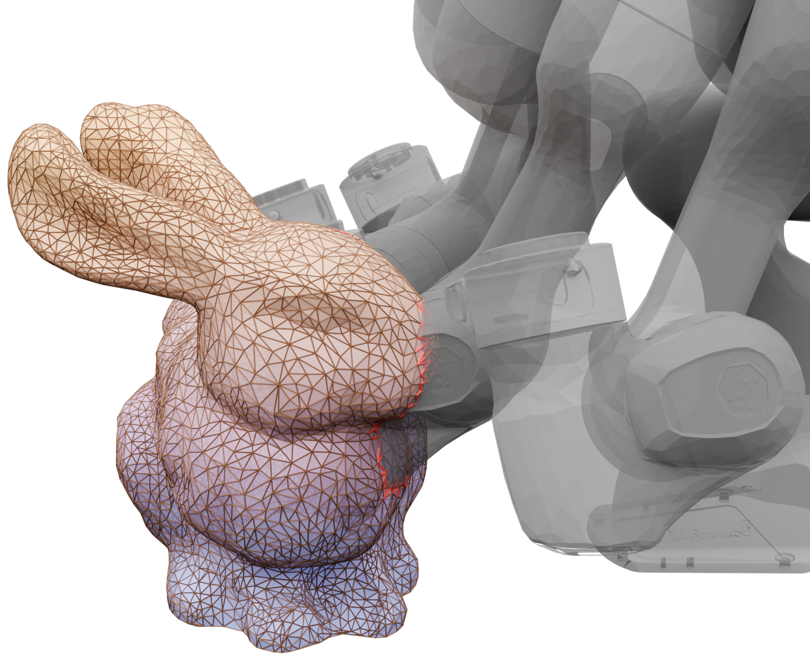
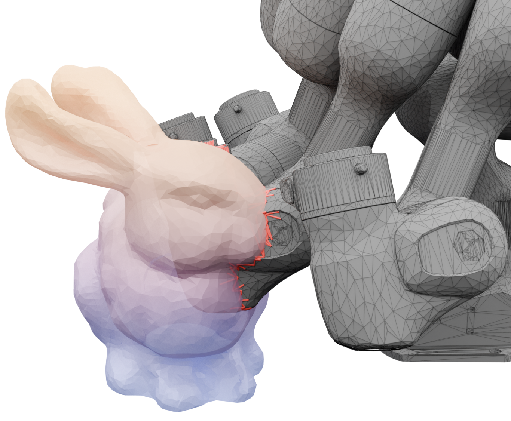
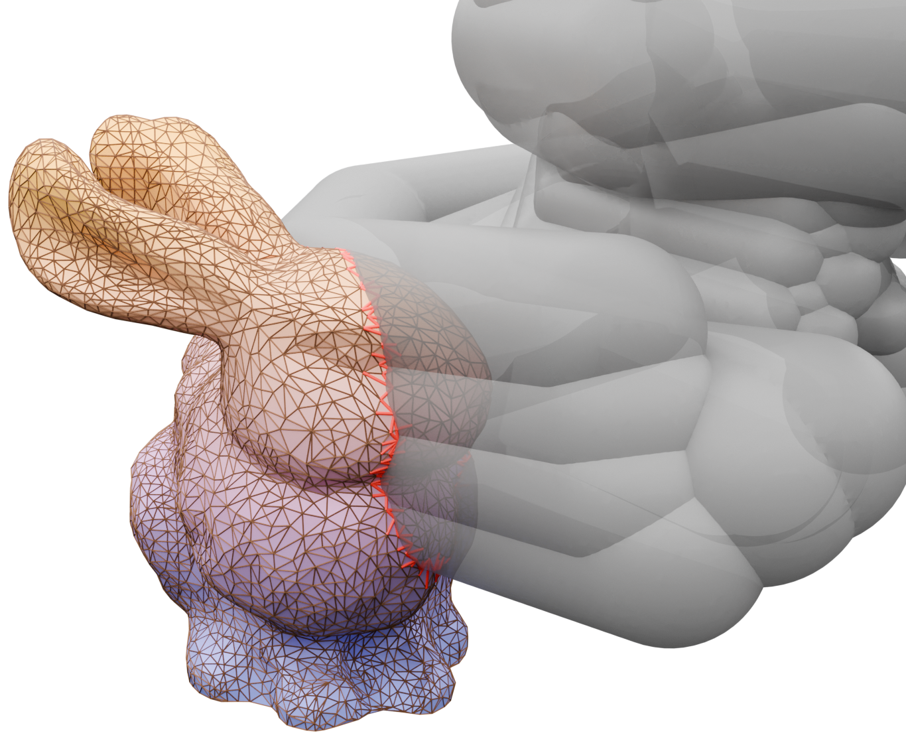
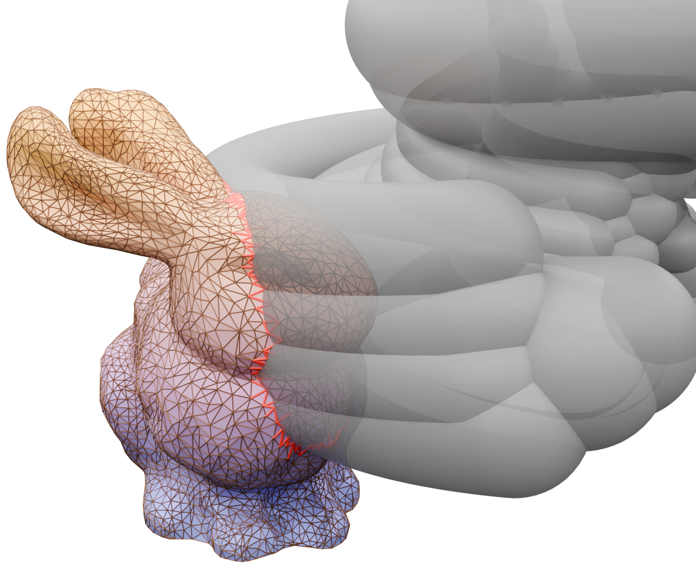

# blender_playground
Fall in love with blender for scentific plotting recently and happen to be a guy fancinate about both ray-tracing and cool visualization. 

Some of the following images may come from my paper.

<table>
    <tr>
        <td>Image</td>
        <td>Source</td>
    </tr>
    <tr>
        <td></td>
        <td>The original one looks better and its hand-drawn (I guess).</td>
    </tr>
    <tr>
        <td>
            <table>
                <tr><td> </td></tr>
                <tr><td> </td></tr>
                <tr><td></td></tr>
                <tr><td></td></tr>
                <tr><td></td></tr>
            </table>
        </td>
        <td>From <a href="https://arxiv.org/abs/2409.09918">Hardware-Accelerated Ray Tracing for Discrete and Continuous Collision Detection on GPUs</a></td>
    </tr>
</table>
