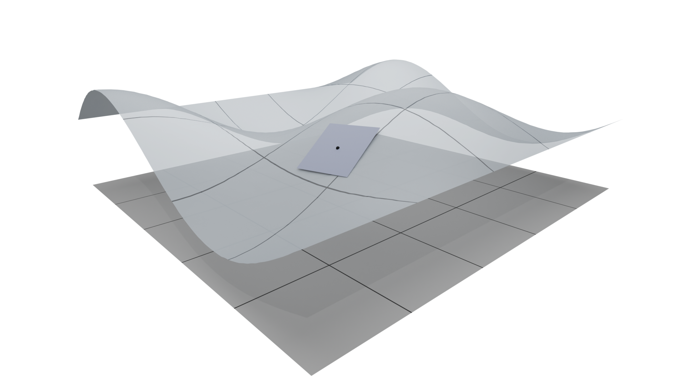
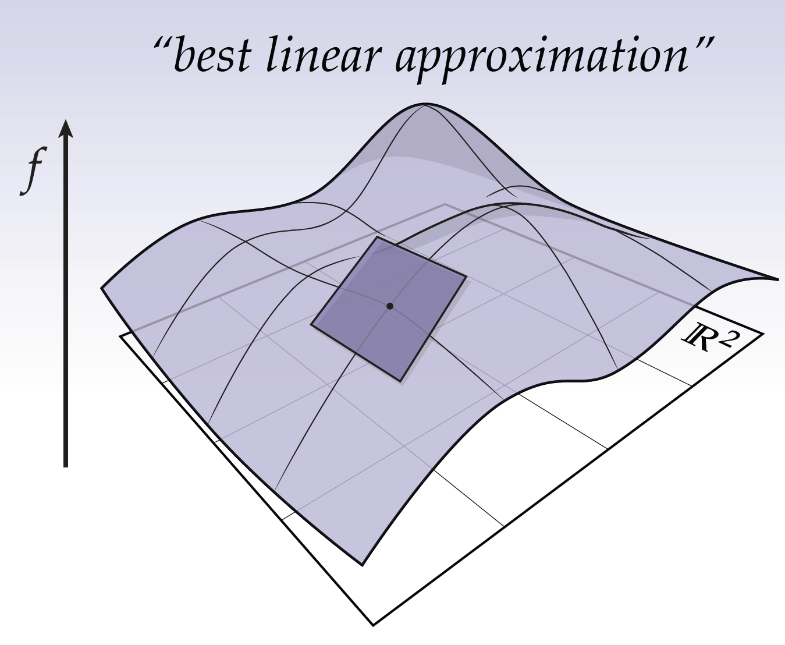
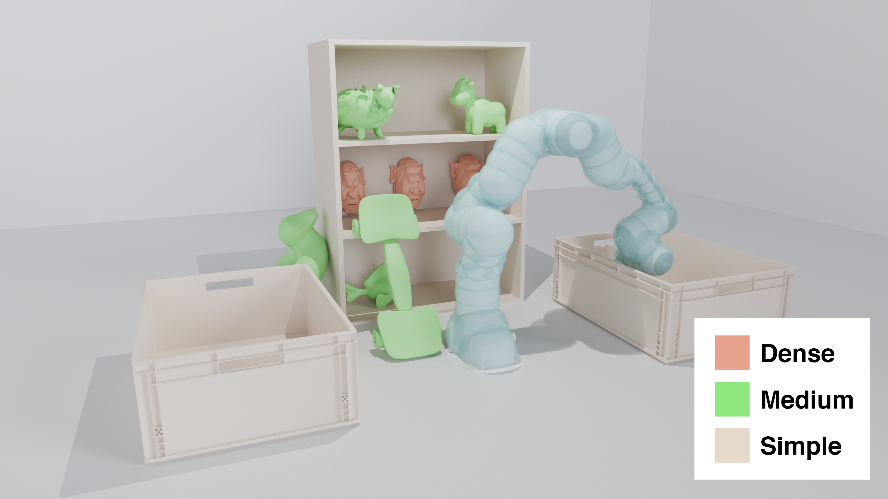

# blender_playground
Fall in love with blender for scentific plotting recently and happen to be a guy fancinate about both ray-tracing and cool visualization. 

Some of the following images may come from my paper.

| Image | Source |
|----------|----------|
|  |    The original one looks better and its hand-drawn (I guess). |
|    | From [Hardware-Accelerated Ray Tracing for Discrete and Continuous Collision Detection on GPUs](https://arxiv.org/abs/2409.09918)    |
